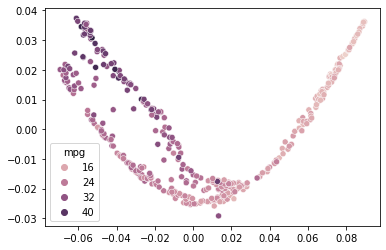

# RF-PHATE

RF-PHATE is a package which allows the user to create random forest-based supervised, low-dimensional embeddings based on the 
manifold learning algorithm described in 
[Random Forest-Based Diffusion Information Geometry for Supervised Visualization and Data Exploration](https://ieeexplore.ieee.org/document/9513749)

## Installation and updating
Use the package manager [pip](https://pip.pypa.io/en/stable/) to install RF-PHATE.
Rerun this command to check for and install  updates .
```bash
pip install git+https://github.com/jakerhodes/rfphate
```

The two main classes are RFPHATE and RFPHATEReg (The latter for continuous response variables (Reg for Regression)).
Here we use the same sklearn fit_transform style. See a demo below.

#### Demo of use of RFPHATEReg:
```python
from rfphate import dataset, rfphate, proximity
import pandas as pd
import seaborn as sns

# Read in the data
data   = pd.read_csv('data/auto-mpg.csv', sep = ',')
x, y   = dataset.normalize_data(data, label_col = 0)

rfphate_op = rfphate.RFPHATEReg(random_state = 0)
emb = rfphate_op.fit_transform(x, y)

sns.scatterplot(x = emb[:, 0], y = emb[:, 1], hue = data.iloc[:, 0])
```



## License
[GNU-3](https://www.gnu.org/licenses/gpl-3.0.en.html)
