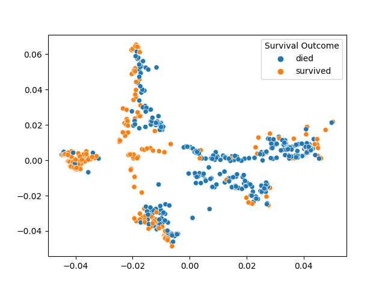

# RF-PHATE

RF-PHATE is a package which allows the user to create random forest-based supervised, low-dimensional embeddings based on the 
manifold learning algorithm described in 
[Gaining biological insights through supervised data visualization](https://rdcu.be/frebO)

For up-to-date RF-PHATE code, please see https://github.com/jakerhodes/RF-PHATE.

For use of RF-PHATE, please cite the following:

J.S. Rhodes, A. Aumon, S. Morin, M. Girard, C. Larochelle, B. Lahav, E. Brunet-Ratnasingham, W. Zhang, A. Cutler, A. Zhou, D.E. Kaufmann, S. Zandee, A. Prat, G. Wolf, K.R. Moon, “Gaining biological insights through supervised data visualization,” *Nature Computational Science*, June 2026. [Link](https://rdcu.be/frebO)

J. S. Rhodes, A. Cutler, G. Wolf and K. R. Moon, "Random Forest-Based Diffusion Information Geometry for Supervised Visualization and Data Exploration," *2021 IEEE Statistical Signal Processing Workshop (SSP)*, Rio de Janeiro, Brazil, 2021, pp. 331-335, doi: [10.1109/SSP49050.2021.9513749](https://doi.org/10.1109/SSP49050.2021.9513749).

